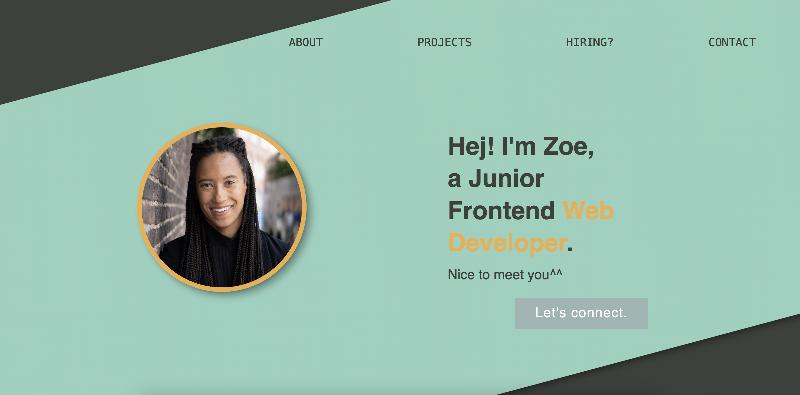
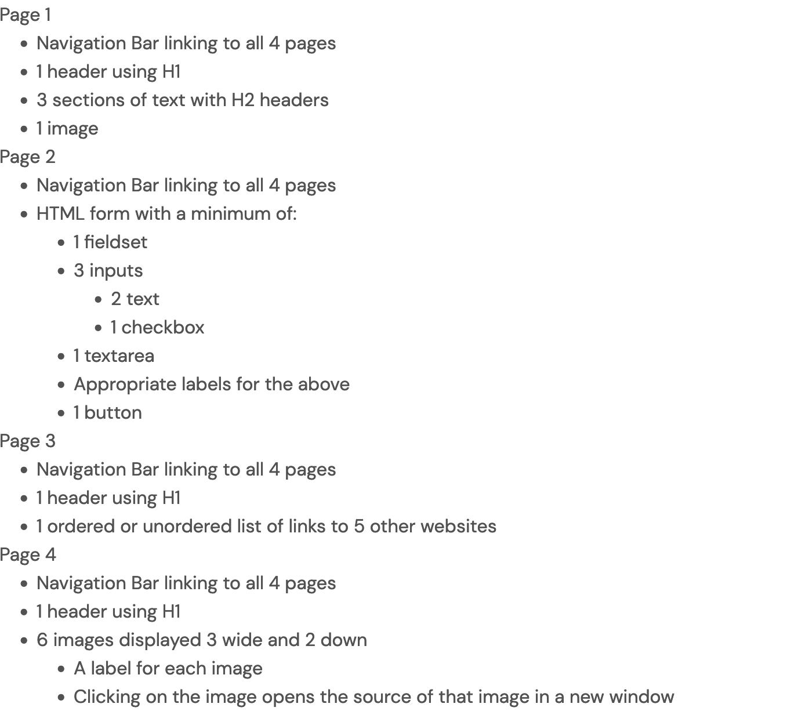

# a/A Open: HTML and CSS Capstone Project

[app Academy](https://www.appacademy.io/) is a San Francisco-based software engineering bootcamp that offers courses both online and on campus. This repository contains my personal solution to "HTML and CSS Capstone Project" as part of [a/A Open](https://www.appacademy.io/course/app-academy-open), the free version of a/A's entire online full-stack curriculum.

## Live Site Demo

  

  [Live Site](https://zowdk.github.io/html-and-css-capstone-project/)

## Objective

  Practice designing, building and styling a four-page site.

## Implementation Highlights

### CV Request Form

    - This assignment became a chance to redesign my portfolio site. I wanted to set up a way for potential employers and collaborators to be able to request my CV. So I added a [Typeform](https://www.typeform.com/) to help with handling the requests. 
    

## Project Requirements

  

## Known Issues

### Typeform limitations

- The free version of Typeform only allows 10 requests per month. 

### DRYer Code

- There are 4 CSS documents averaging ~450 lines each. It might be a good idea to simplify the code with utility classes, or to remove unnecessary lines.

## Acknowledgements

- Not set up yet.

< / > by [@zowdk](https://twitter.com/zowdk)
