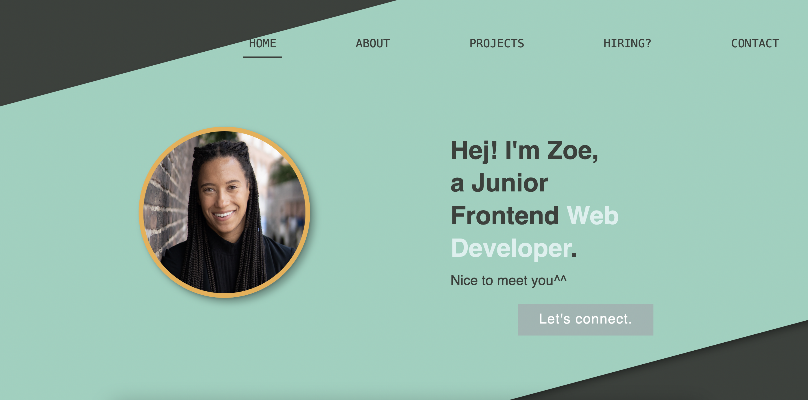

# a/A Open: HTML and CSS Capstone Project

[app Academy](https://www.appacademy.io/) is a San Francisco-based software engineering bootcamp that offers courses both online and on campus. This repository contains my personal solution to "HTML and CSS Capstone Project" as part of [a/A Open](https://www.appacademy.io/course/app-academy-open), the free version of a/A's entire online full-stack curriculum.

## Live Site Demo

[Live Site](https://zowdk.github.io/html-and-css-capstone-project/)

## Objective

Practice designing, building and styling a four-page site.

## Implementation Highlights

- Not set up yet.

## Project Requirements

- Not set up yet.

## Known Issues

-Not set up yet.

## Acknowledgements

- Not set up yet.

< / > by [@zowdk](https://twitter.com/zowdk)
